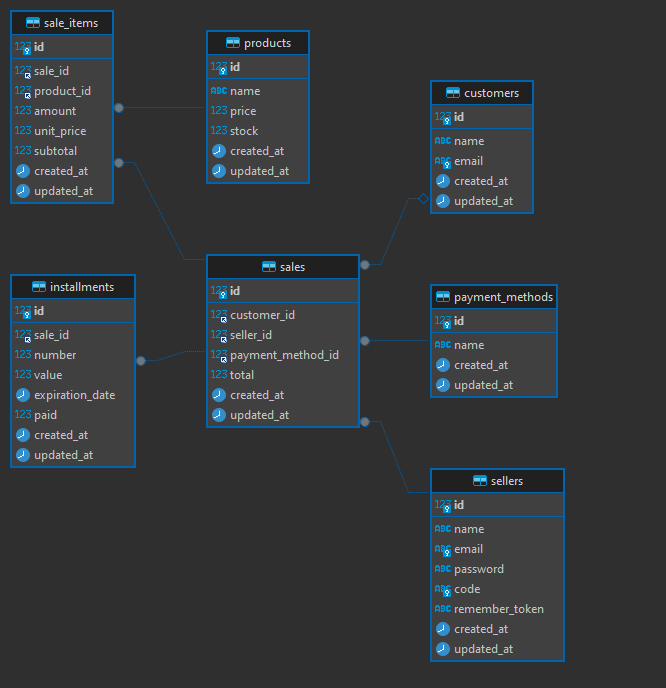

<div align="center">

[](https://skillicons.dev)

</div>

# Sistema de Venda

Este é um teste feito com intuito de implementar um pequeno sistema de vendas com o laravel.

# Manual de instalação

Para rodar o projeto, inicialmente, é necessário ter o php 8.2+, composer 2.7.9, mysql e nodejs.

Primeiro de tudo é necessário clonar o projeto. No terminal digite o seguinte comando <code>git clone https://github.com/rodi38/dcteste.git</code>
Outra opção é baixar o projeto em formato zip clicando no botão <b><> Code</b> e escolhendo a opção <b>Download ZIP</b>

Com o clone feito, é necessário alterar o nome do arquivo <code>.env.example</code> para <code>.env</code> e parte de seu conteudo.

ANTES:

```
DB_CONNECTION=sqlite
# DB_HOST=127.0.0.1
# DB_PORT=3306
# DB_DATABASE=laravel
# DB_USERNAME=root
# DB_PASSWORD=
```

DEPOIS:

```
DB_CONNECTION=mysql
DB_HOST=127.0.0.1
DB_PORT=3306
DB_DATABASE=NomeDoSeuBanco
DB_USERNAME=SeuNomeDeUsuario
DB_PASSWORD=SuaSenha
```

Fique atento na hora de preencher estes campos, se tiver alguma informação errada o projeto não vai rodar!

após isso, rode os seguintes comandos no terminal, respectivamente:

<code>composer install</code>
<code>php artisan key:generate</code>
<code>php artisan migrate</code>
<code>npm install</code>
<code>npm run build</code>

Ao rodar o comando migrate, digite <b>yes</b> e pressione enter caso apareça alguma pergunta.


terminando essa leva de comandos, é hora de rodar a aplicação com o seguinte comando no terminal: <code>php artisan serve</code>

após rodar a aplicação basta acessar a página de vendas <code>http://localhost:8000/sales</code>

<hr>

<hr>

<hr>

Como informado anteriormente, o intuito do projeto era criar o que seria um pequeno sistema de vendas.

Tendo como principais objetivos de efetuar uma venda, escolher numero de parcelas, ajustar parcelas e recalcular o valor delas automaticamente, listar Vendas/Vendedores/Clientes, ter um relacionamento claro entre vendedor e venda, venda e parcelas, venda e o cliente, e muito mais relacionamentos.

Deixo aqui uma imagem que representa o diagrama atual do projeto.


